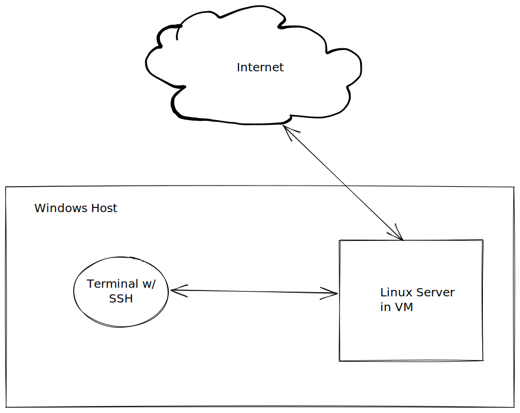

# Week 02 - Boost Notes

Setup of work environment as is, Ubuntu Server VM running on Windows host connected w/ SSH protocol from same computer.

Reason behind this setup is linux is easy to break not fun to experiment with hard to recover any configuration you mess up.

In VM I can host multiple Operating Systems and experiment with different features on each as I like.

Another reason is that I am gaming on my rig and I would like to keep it that way I don't like to go through trying to run games even though linux improved significantly in small time in this area.

I simply don't need to be stuck on windows I can do everything I need to do through command line via `SSH` and `TMUX` on VMs and different VMs for different things I am working. 

## Harmfulness of Abstractions
Abstractions are better once you at least know what are you being abstracted away from,
otherwise you will have a lot headaches working bluntly on the high levels of tech sea

## REPL?
Commandline interface is synonymous also known as REPL (Read, Evaluate, Print, Loop)

Shell - program that allows access to lower layer of a system (hence shell)

## Essentials
* As soon as you login to a new Linux System do a system update

Getting hacked is really easy if you are bridged, if someone breaks into your wifi they can easily get into your computer. Don't trust your wifi password always be **_hardlined_** and take all necessary measures to work via remote access.

>Doing system update is one of these measures due to security reasons.

>TL;DR(`man apt`): Debian package manager use `apt-get` from scripts and use `apt` from CLI

## Why everything is a file?
`inode` entry in a table, a directory is a table of inodes an those inodes have names and different types one type is a file another one is a directory. 

`stat` is the command I wanted to remember, to see the node information.

`cd -` change to previous directory
