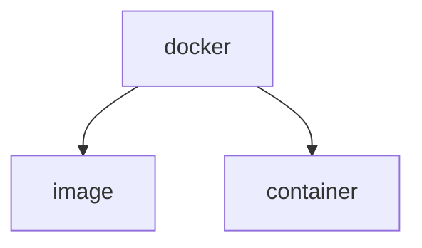

# Docker
>Why should I learn docker after all this is mostly done by OPS people.
> 
> *The best developers understand ops and The best ops understand developers.*

- labs.play-with-docker.com provides 4 hour docker instances.

Docker helps with environment consistency.

## Introduction

Docker is language agnostic, meaning any language or package is good to go with docker. It does not care about the it.

Any application might specify the port it listens hence we should be careful binding ports when starting docker containers

> *Dockerfile*
>
> Is set of instructions to build application and its dependencies inside a container.

> *Image vs Container*
>
>Images are buildtime constructs and containers are runtime constructs. Hence an image makes a VM template.

An image of a container has a layered file system, such as a stack of books and every book is different part of a story.

`$ sudo docker container run -d --name web -p 8080:8080 sbecerek/container:latest`

Above is an example of running docker container as background service (`-d`) this command returns the id of container `59a43ff3decd0de389a18a29bad852d79cc00a4a078414f23283ad61f3952a97` this could be verified with 
`sudo docker container ls`

Above is not the whole syntax tree of the docker however it is important to grasp the idea of image and container. An image is a static snapshot of an application's code and dependencies, while a container is a running instance of that image that includes the application and any runtime dependencies.

- `Containerized App` - An application that runs inside a container.

We may stop, start, kill etc. a container. for example `docker container stop <name>/<id>` sends a SIGTERM signal to the container.

Unless we `rm` the container it is there to be removed.

`docker container run -it --name test alpine sh` runs a shell inside a container, `exit`ing the shell causes container to be killed since main container is killed in a Linux environment. Instead we should use `Ctrl+P+Q` to detach terminal from contianer.

>*Cloud Native Microservices* - Nigel
> 
>That different features of an app break them apart and code them independently.
>
> Allows independently scaling, patching and modifying a single part.

>*Docker Compose*
>
>*Declarative*
>Describing the desired state of your application in a config file that you use to deploy and manage the app
> 
>A docker compose config file is such a file that does this.

>*Docker Swarm Cluster* 
>
> Cluster of Containers that Comprises of managers and workers.
>Managers host the control plane features, scheduling and consisting the state of the cluster

Docker desktop can still run in a swarm mode.

Running at swarm mode enables the `docker service`s. We may deploy apps and achieve microservices like this.

There is a reconciliation loop in the cluster that checks if observed state is matching the desired state, in a case we want 10 instances and observed state sees 7 instances it launches new containers.

- Swarm or Cluster does not support building apps on the deploy time. We may use `docker stack` command to deploy our docker compose file.

## Dockerfiles
Always the first instruction we define in a docker file is `FROM` (`FROM node:alpine`) instruction.

Next instruction could be metadate with `LABEL` instruction.

We can also define environment variables with `ENV`.

When running a base image like Node or ASP.NET, it is important to specify the `WORKDIR` this is the directory our code lives in.

`COPY` instruction takes two arguments in case of `COPY . .` first dot represents execution directory and second dot represents path specififed in `WORKDIR`.

`EXPOSE` is port that will be exposed outside the container. This also should be the Internal port when running the container with `-p`
flag.

`ENTRYPOINT` tells what should be run to start the application.

- `docker rm` and `docker rmi` are different in first one removes containers latter one removes the images. One may also write `docker image/container rm`. 

> **Note**
>
> Keep in mind that not specifying `.dockerignore` might cause long build time due to copying of `node_modules` or other similar directories that contain packages.

> **Tip**
>
> VS Code Docker extension is very useful in providing intelisense for docker files and more...

> **Tip**
>
> Tagging an image with the latest all the time is not the best idea, we rather prefer to have some differences between versions.

Using `docker logs` we may look at the container logs.

Logs is an important idea for running containers, We may create a volum mount that is in the host. This will allow logs to be outputed there.

Similarly we may keep them in container. In case a crash this will 
be of no use.

`-v` tag to specify volume while running the container. 

Volumes are way to inject different things inside containers, how?

`docker run -p 8080:80 -v $(pwd):/usr/share/nginx/html nginx:alpine` is mounting current directory by `pwd` to nginx directory which has default html content, and serving custom html docs.

This may get complicated in ways that we are able to write to network locations.

## Communication

When we have multiple containers that need to talk to each other we may create a `bridge network`.

We may check documentation network drivers.

`docker network create --driver <driver_type> <network_name>` is used to create network for more information `docker network -h`

We may add any container into a network while running by adding the `--net=<name_of_network>` when running the container. `--name` becomes important in this case because this is simply the name of the host, for API and DB connection this is important.

Such network could be created using `docker-compose` in declarative way.

