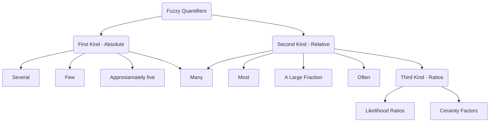

## Fuzzy Quantifiers

Quantified statements such as 

> "Most students pay their own tuition" or "About half the guests gave presents" 

provide a very significant means by which people summarize observations about the world. 

Any attempt to build intelligent computer based systems must provide a mechanism for representing and reasoning with such statements.

Lotfi A. Zadeh suggested an aprroach for the representation and manipulation of quantified statements based upon the use of fuzzy sets.

> **Fuzzy Sets**
> A Fuzzy set is a pair (U,m) where U is a set and $$m: U \rightarrow [0,1]$$ a membership function.
>set U is called universe of discourse, and for each $x \in U$, the value m(x) is called the grade of membership of x in (U,m).
>Let $x \in U$ then x is called: 
>
> **not included** in the Fuzzy set (U,m) if $m(x) = 0$
>
>**fully included** if $m(x) = 1$
>
>**partially included** if $0 < m(x) < 1$ 

- Montague - Contributed to our understanding of proper treatments of quantifiers `all`, `some` and `any`
- Barwise and Cooper - Described methods for dealing with `generalized quantifiers` exemplified by `most`,   `many`.
- Zadeh and Others - Described in a series of papers from 1975. Quantifiers above as well as some other quantifiers w/ imprecise meaning `few`, `several`, `not very many` are treated as **`fuzzy numbers`** and referred to as fuzzy quantifiers.

To illustrate the concept we may think about the quantifier `most` given the sentence "Most big men are nice" what is the degree defines the most? For all we know it could be any number above %51.

It is interpreted as a fuzzily defined proportion of the fuzzy set of kind men in the fuzzy set if big men. Then, the `Cardinality` concept of a fuzzy set is used compute the proportion in question and find the degree to which it is compatible with the meaning of `most`.

We are employing the Absolute (first kind) and Relative (second kind) Fuzzy Quantifiers to refer to Absolute and Relative counts. Observe that a quantifier such as `many` could be employed in either sense depending on the context.

- Examples of quantifiers of the first kind are: severul, few, many, not very
many, approximately five, close to ten, much larger than ten, u large number, etc. 
- Examples of second kind are: most, many, a large fruction, often, once in a while, much of, etc. Where needed, ratios of fuzzy quantifiers of the second kind will be referred to as fuzzy quantifiers of the third kind. Examples of quantifiers of this type are the likelihood ratios and certainty factors which are encountered in the analysis of evidence, hypothesis testing and expert systems

Fuzzy Quantifiers in out daily life appear implicitly rather than explicitly, when it is asserted that:
- `"Basketball players are very tall"` it is meant `"Almost all basketball players are very tall"`
- `"Lynne is never late"` it is meant `"Lynne is late very rarely"`.

An interesting note about the fuzzy quantifiers should be made regarding the transitive closure.
$p \equiv  all A's\ are\ B's$ and $q \equiv  all B's\ are\ C's$ then
$r \equiv  all A's\ are\ C's$ the quantifier `all` in p and q is replace by `almost all`, then the quantifier all in r should be replace by `none-to-all`. Slight change in quantifiers in premises may result in conclusion.

Natural way to dealing with the fuzzy quantifiers is to treat them as fuzzy numbers. However this does not mean that the fuzzy quantifiers exist together with fuzzy number.

In the proposition “Vickie is several years younger than Mary.” `several` - fuzzy number does not play the role of a fuzzy quantifier whereas in "Vickie has several good friends." it does.

“Vickie has several credit cards,” several is a fuzzy characterization of the cardinality of the nonfuzzy set of Vickie’s credit cards; in “Vickie has
several good friends,” several is a fuzzy characterization of the cardinality of the fuzzy set of Vickie’s good friends;

A Simple example to show how Fuzzy Quantifiers can be treated as Fuzzy numbers

$$ p \equiv  80\% of students\ are\ single$$ 
$$q \equiv  60\% of students\ are\ male$$ 
$$r \equiv  Q\ of\ students\ are\ single\ and\ male$$ 

$r$ is the answer to the question "What percentage of students are sinle and male?" Clearly the answer is $80\%x60\%=48\%$ 

We may generalise this in $p \equiv  Q_1\ of\ A's\ are\ B's$ and $q \equiv  Q_2\ of\ (A\ and\ B)'s\ are\ C's$ then $r \equiv  Q_1Q_2\ of\ A's are (B\ and\ C)'s$

Assume $Q_1$ and $Q_2$ are fuzzy quantifiers of second kind - Relative
$$ p \equiv  most\ of students\ are\ single$$ 
$$q \equiv  a\ little\ more\ than\ a\ half\ of students\ are\ male$$ 
$$r \equiv  ?Q\ of\ students\ are\ single\ and\ male$$ 

where the question mark indicates that value of Q to be inferred from $p$ and $q$.

Interpreting most, a little more than a half and Q as fuzzy numbers we can see that Q may be expressed as a product in fuzzy arithmetic $Q = most \otimes a\ little\ more\ than\ a\ half$

>**Intersection/Product Syllogism**
>
>We may generalise this in $p \equiv  Q_1\ of\ A's\ are\ B's$ and $q \equiv  Q_2\ of\ (A\ and\ B)'s\ are\ C's$ then $r \equiv  Q_1 \otimes Q_2\ of\ A's are (B\ and\ C)'s$

