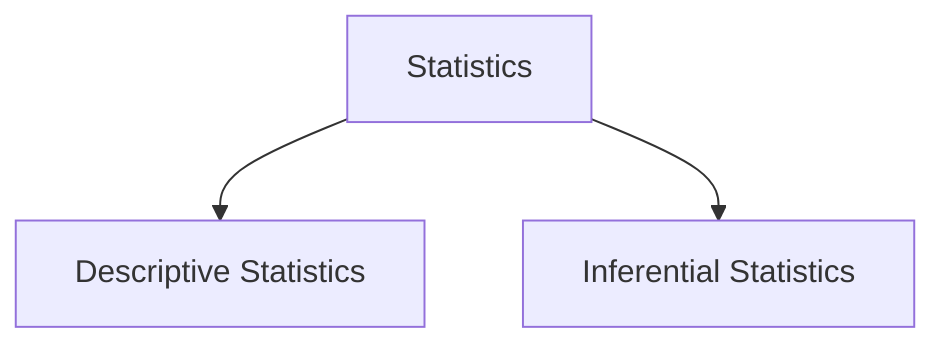
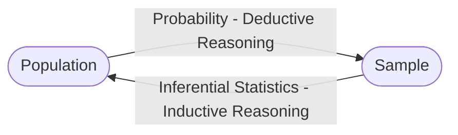
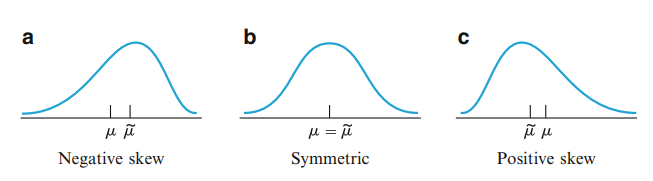
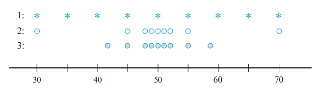

# Introduction

Discipline of statistics teaches us how to make intelligent judgments and informed decisions in the presence of uncertainty and variation. Without uncertainty or variation, then a single observation would reveal all desired information.

Suppose there are two medications that are equally effective, however during testing new medication could be applied to people who have **less severe headaches and have less stressful lives** then an observation occurs that are not attributable solely to the medications, bu to poor choice of **test groups**.

Statistics offers not only methods for analyzing the results of experiments but also suggestions for how experiments can be performed in an efficient to minimize effects of variation and have better chance of producing correct conclusions.

Statistics is a science that is divided into two areas

- Descriptive Statistics - collecting, organizing, summarizing, presenting data.
- Inferential Statistics - making decisions, predictions, drawing conclusions from the data.

Summary

Statistics is a science tells us how to make accurate decision when there is a variety in data, without variety single observation would yield sufficient to make decisions.
It also suggests ways to conduct experiments to minimize side effects. Field of statistics is split into two areas Descriptive and Inferential statistics.

## Populations and Samples

An investigation will typically focus on a well-defined collection of objects constituting a **population** of interest. for example, population consisting of all individuals who received a B.S. in mathematics during the most recent academic year. When desired information is available for all objects in population we have what is called a **census** when constraints on time, money or other scarce resources are applied making a **census** becomes impractical or infeasible.

Instead a subset of **population** - **a sample** is selected in some prescribed manner. Thus we might select a sample of last year's graduates to obtain feedback about the quality of the curriculum.

We are usually interested only in certain characteristics in population: the gender of mathematics graduate, the age at which the individual graduated, and so on.

A characteristic could be **categorical** (female, sophomore) or numerical(age = 23 years)

A **variable** is any characteristic whose value may change from one object to another in population.

Sample is a means to an end rather than the end itself, We may use techniques for generalising from sample to population. Such techniques are gathered in the branch of statistics called **inferential statistics**.

In a statistics problem, characteristics of a sample are available to the experimenter and this information enables experimenter to draw conclusions about the problem.

## Measures of Location

Data set of $n$ observations usually denoted by $x_1, x_2, \dots, x_n$ where $n$ is the number of observations in the data set.

---

###### Definition

The sample mean (_measure of sample location_) $\bar{x}$ of observations $x_1, x_2, \dots, x_n$ is defined as
$$\bar{x} = \frac{x_1 + x_2 + \dots + x_n}{n} = \frac{\sum_{i=1}^{n}x_i}{n}$$

---

If we think placing each observation as 1lb weight placed on a horizontal measurement axis. Then the sample mean is the balance point of the weights where a fulcrum would be placed to balance the weights.

If $\sum_{i=1}^{n}(x_i - \bar{x}) = 0$ (Net total tendency to turn about $\bar{x}$) then the system balances.

---

###### Definition

Average of all values in a population is called **population mean** denoted by $\mu$ (_characteristic of population_). If $N$ is the number of observations in population then
$$\mu = \frac{\text{sum of N values}}{N}$$

---

Mean value is highly vulnerable to be affected by an outlier.

---

###### Definition

Sample median denoted $\tilde{x}$ is middle value when we order values $x_1, x_2, \dots, x_n$ from smallest to largest. If $n$ is odd then median is ${(n+1)/2}^{th}$ element from sample, if $n$ is even then median is elements in order ${ n/2 }^{th} \text{ and } {n/2 + 1}^{th}$ or their average.

---

Contrary to $\bar{x}$, $\tilde{x}$ is not affected so much by outliers. Changing one outlier doesn't change the median value while changing one outlier can change the mean value drastically.

In this sense mean and median are opposite ends of a spectrum. Both mean and median are **Measures of Central Tendency**.

---

###### Definition

There is also a middle value for the whole population that is called **population median** denoted by $\tilde{\mu}$.

---

Considering that median is less susceptible to outliers, it may be used to decide whether one is compensated fairly.

Usually $\mu$ and $\tilde{\mu}$ are not equal, however if the population is symmetric then $\mu = \tilde{\mu}$. If the population is skewed then we need to consider which property to use.

Median divides population into two equal parts, To obtain finer measures of location, we could divide the data into more than two such parts.

Quartiles divide data into four equal parts:

- $Q_1$ is the median of the lower half of the data.
- $Q_2$ is the median of the data.
- $Q_3$ is the median of the upper half of the data.

A given data set could also be divided by percentiles an example is: 99th percentile, this is a value that seperate the top 1% of the data from the rest of the data.

The sample mean and sample median are influenced by outlying values in different manner. Since extreme behaviour of either type might be undesirable we might consider alternative measures neither as sensitive as mean nor as insensitive as median.

## Measures of Variability

Reporting/Describing only center gives partial information about the dataset or distribution. We also need to consider the variability of the data. Since Different samples may have identical measures of center yet differ from one another.

- In the Image above 1st sample has the largest variability while the 2nd sample has the least variability.

As a simplest measure of variability we may take **range** difference between largest and smallest values.

---

Primary measure of variability is <u>deviations from the the mean</u> $x_1 - \bar{x}, x_2 - \bar{x}, ..., x_n - \bar{x}$. If each of these values are small in magnitude then all $x_i$'s are close to the mean.

$$
\text{Sum of deviations} = \sum_{i=1}^{n}(x_i - \bar{x}) = 0
$$

result is equal to zero because positive and negative deviations (coming from values to the left of mean and the right of mean) cancel each other. To get rid of such effect we may take the square root of each deviations and then sum them up.

$$
\text{Sum of squared deviations} = \sum_{i=1}^{n}(x_i - \bar{x})^2
$$

then sample variance is defined as

$$
\text{Sample Variance} = s^2 =  \frac{\sum_{i=1}^{n}(x_i - \bar{x})^2}{n-1} = \frac{S_{xx}}{n -1}
$$

then the sample standard deviation is defined as the positive root of

$$
\text{Sample standard deviation} = s = \sqrt{s^2}
$$

Sample standard deviation has the same unit as each of the $x_i$'s. We use sample variance instead of sum of squared deviations to measure sample variability because of a measure called **population variance** denoted $\sigma^2$. When N is finite population variance is defined as

$$
\sigma^2 = \frac{\sum_{i=1}^{N}(x_i - \mu)^2}{N}
$$

As in sample standard deviation, Population standard standard deviation is defined as $\sigma = \sqrt{\sigma^2}$.

Realize we divide sample variance by $n-1$ while dividing population variance by $N$. We may make inferences about $\sigma^2$ from $s^2$, $\sigma^2$ involves squared deviations about the population and mean $\mu$

Knowing $\mu$ we could compute $\sigma^2$ exactly, however $\mu$ is usually unknown so the sum of the squared deviations about $\bar{x}$ is used as an estimate of numerator of $\sigma^2$.

Also note that $x_i$'s tend to be closer to the average $\bar{x}$ then to the population average $\mu$, so to compensate divisor $n-1$ is used instead of $n$. Using $n$ we would underestimate $\sigma^2$.

Let $x_1, x_2, \dots, x_n$ be sample and c be constant. Then

- If $y_1 = x_1 + c, y_2 = x_2 + c, \dots, y_n = x_n + c$ then $s_y^2 = s_x^2$
- If $y_1 = cx_1, y_2 = cx_2, \dots, y_n = cx_n$ then $s_y^2 = c^2s_x^2$
