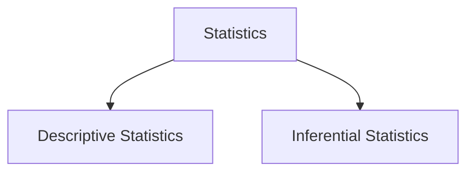

# Introduction

Discipline of statistics teaches us how to make intelligent judgments and informed decisions in the presence of uncertainty and variation. Without uncertainty or variation, then a single observation would reveal all desired information. 

Suppose there are two medications that are equally effective, however during testing new medication could be applied to people who have **less severe headaches and have less stressful lives** then an observation occurs that are not attributable solely to the medications, bu to poor choice of **test groups**.

Statistics offers not only methods for analyzing the results of experiments but also suggestions for how experiments can be performed in an efficient to minimize effects of variation and have better chance of producing correct conclusions.

Statistics is a science that is divided into two areas

- Descriptive Statistics - collecting, organizing, summarizing, presenting data.
- Inferential Statistics - making decisions, predictions, drawing conclusions from the data.

Summary

Statistics is a science tells us how to make accurate decision when there is a variety in data, without variety single observation would yield sufficient to make decisions.
It also suggests ways to conduct experiments to minimize side effects. Field of statistics is split into two areas Descriptive and Inferential statistics.

## Populations and Samples 

An investigation will typically focus on a well-defined collection of objects constituting a **population** of interest. for example, population consisting of all individuals who received a B.S. in mathematics during the most recent academic year. When desired information is available for all objects in population we have what is called a **census** when constraints on time, money or other scarce resources are applied making a **census** becomes impractical or infeasible. 

Instead a subset of **population** - **a sample** is selected in some prescribed manner. Thus we might select a sample of last year's graduates to obtain feedback about the quality of the curriculum.

We are usually interested only in certain characteristics in population: the gender of mathematics graduate, the age at which the individual graduated, and so on.

A characteristic could be **categorical** (female, sophomore) or numerical(age = 23 years)

A **variable** is any characteristic whose value may change from one object ot another in population.