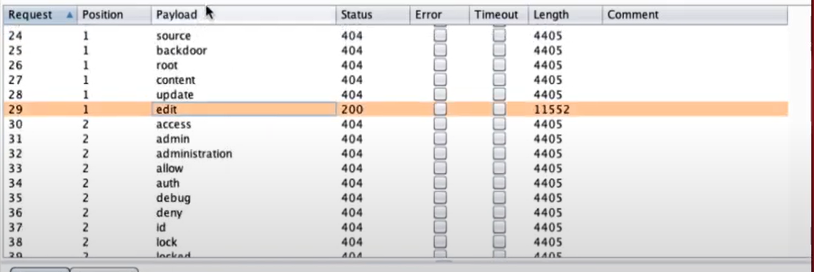

# IDOR - Insecure Direct Object Reference

How does a web application work in the core?

Input - A web application needs a request/command to work in the beginning.
In terms of attack surface an application that doesn't take any input nearly non-existing e.g. An Application that only writes the system clock

However, today such an application nearly does not exists with few small exceptions.

In modern day application the all of the information inside the HTTP request means Input.

An Application needs to give some information to the end-user, Imagine a website like amazon, you add multiple addresses these addresses are stored and when you are checking out they are listed for selection which you select and resend it back to the application.

Here IDOR is one of the most important risk factor, while a web app does its Job it does CRUD operations which are compliant with some rule sets e.g. when you are checking out of amazon.com you should not be able to see other users' addresses because of a certain rule if we manipulate our input in any way and see other users' addresses this is the most basic IDOR vulnerability

Burp Suite - proxy to check all the requests inbound/outbound from the machine

Let's thing we have address information in a table

| id  | user_id | title      | address     |
| --- | ------- | ---------- | ----------- |
| 15  | 2       | my address | some street |

with Primary and FK keys.

and endpoint for address controller is `mywebsite.com/addresses/delete/{id}`

If we know the id of our own address is 15 given that this table PK is auto incremented there should be 14 as well, with Burp Suite we are able to stop requests from our browser analyze/change them and send.

when we send the request `mywebsite.com/addresses/delete/12` respond is `302 Found` and it directs us to `mywebsite.com/addresses` when we click the link page gives and error with `Authorization` since developer does not have to give `401` directly on the response, However seeing this response does not mean all the time that you were not able to delete this record

To see the behaviour of the server we send the request `mywebsite.com/addresses/delete/1443432345` some value that possible to not exists in the database this time we get `404 Not Found` then we may guess approximately controller in server looks like this

```
class AddressController extends Controller {
    public function delete(int id) {
        if(!AddressModel->checkaddress(id))
        {
            redirect('/',404)
        }

        AddressModel->deleteAddress(id)
    }
}
```

Missing Function Level Access Control this vulnerability is usually mixed with IDOR

Again with burp suite we may analyze if there are other different controllers trying `mywebsite.com/update` returns `404 Not Found` this implies that such endpoint does not exists.

With Burp Suite we can give list of values and to try and try them all in single click checking the Length and Status of responses we move step further.



Given that front-end of our application does not have such functionality accessing this edit controller results in Missing Function Level Access Control.

However if we try this same endpoint with someone else's record and we are able to see it this means IDOR.

`mywebsite.com/addresses/edit/5` returns a JSON object in one endpoint we have 2 different vulnerabilities

```
class AddressController extends Controller {
    public function edit(int id) {
        address = AddressModel->find(id)
        edit(address)
    }

    public function delete(int id) {
        if(!AddressModel->checkaddress(id))
        {
            redirect('/',404)
        }

        AddressModel->deleteAddress(id)
    }
}
```


